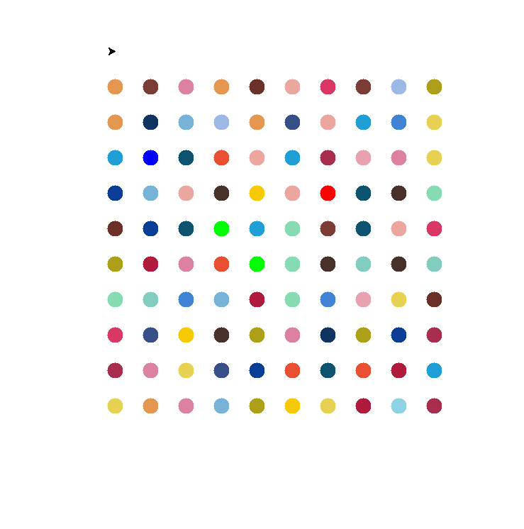

# Hirst Painting 

A Python program that recreates a Damien Hirst-style spot painting using the Turtle graphics library. This project demonstrates procedural art generation by creating a grid of colored dots in random or predefined color patterns.

## Features

* **Hirst-style Spot Painting**: Creates a grid of colored circles reminiscent of Damien Hirst's iconic spot paintings

* **Customizable Grid**: Adjustable number of rows, columns, and spacing

* **Color Options**:

  * Use predefined color palettes

  * Extract colors from images

  * Generate random colors

* Turtle Graphics Visualization: Real-time visualization of the painting proces

## Prerequisites

* Python 3.x

* Required packages:

  * _turtle_ (usually comes with Python standard library)

  * _colorgram.py_ (for image color extraction)

### Installation

1. Clone or download this repository

2. Install the required package:
     > pip install colorgram.py

## Usage

### Basic Usage
Run the main program to generate a Hirst-style painting
 > python main.py

## Customization
Customization
You can modify the following parameters in hirst_painting.py

* DOT_SIZE: Diameter of each dot (default: 22)

* SPACING: Space between dots (default: 50)

* GRID_SIZE: Number of rows and columns (default: 10x10)

* COLOR_PALETTE: List of colors to use

## Color Extraction
To extract colors from an image:

1. Place your image in the project directory

2. Use the color extraction module:

    >
    >from color_extraction import extract_colors
    >colors = extract_colors('your_image.jpg', number_of_colors=30)
    >
## Output
The program will open a Turtle graphics window displaying the generated spot painting. The painting consists of a grid of colored dots with the specified color palette.

### Example output
 

## Contributing
Feel free to contribute to this project by:

Adding new color palettes

Implementing additional features

Improving the documentation

Fixing bugs

## License
This project is open source and available under the [MIT License]().

## Acknowledgments
* Inspired by Damien Hirst's spot paintings

* Uses the Turtle graphics library for visualization

* Color extraction powered by colorgram.py

## Troubleshooting
* If the Turtle window doesn't appear, ensure your Python installation includes Tkinter

* For color extraction issues, verify the image path and format are correct

* Adjust the screen size if the painting doesn't fit properly  

##
_Enjoy creating your own Hirst-inspired digital art! 🎨_

